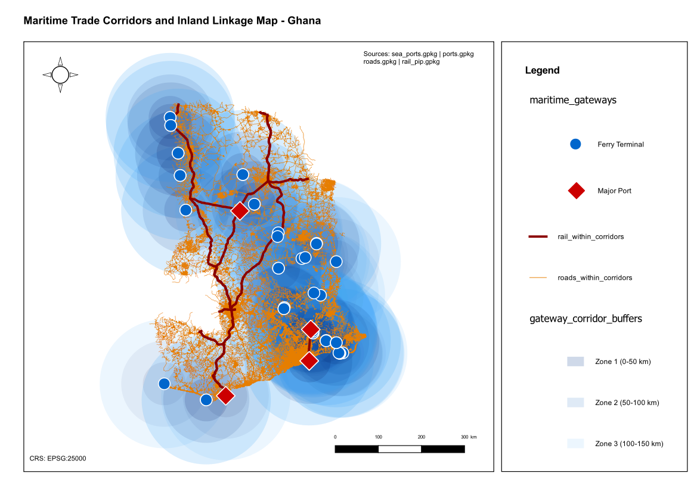

# Maritime Trade Corridor and Inland Linkage Map

**Country:** Ghana
**CRS:** EPSG:25000 - Leigon / Ghana Metre Grid
**Project file:** `Maritime_Trade_Corridor_and_Inland_Linkage_Map.qgz`

---

## Overview

This project maps the inland connectivity of Ghana's maritime gateways (seaports and major port facilities) by analysing road and rail infrastructure within defined corridor zones. Buffer zones are constructed around each maritime gateway to simulate trade catchment areas, and road and rail lines within those corridors are extracted to reveal how well each gateway is connected to the national interior.

## Reference Layout

---

## Objectives

- Define corridor zones around each maritime gateway using buffer analysis.
- Extract road network segments within each gateway corridor.
- Extract rail network segments within each gateway corridor.
- Assess the depth and type of inland linkage available to each port or coastal gateway.

## Methodology

1. Maritime gateways (seaports and port facilities) reprojected to EPSG:25000 and stored as `maritime_gateways.gpkg`.
2. Buffer zones generated around each gateway to represent the trade corridor area: `gateway_corridor_buffers.gpkg`.
3. Road network clipped and intersected against corridor buffers: `roads_within_corridors.gpkg`.
4. Rail network clipped and intersected against corridor buffers: `rail_within_corridors.gpkg`.
5. Layers styled and composed in the QGIS print layout.

## Output Layers

| File | Description |
|------|-------------|
| `maritime_gateways.gpkg` | Maritime gateways (ports and seaports) reprojected to EPSG:25000 |
| `gateway_corridor_buffers.gpkg` | Buffer zones defining trade corridors around each gateway |
| `roads_within_corridors.gpkg` | Road segments within gateway corridor zones |
| `rail_within_corridors.gpkg` | Rail segments within gateway corridor zones |

## Key Findings

- Ghana's primary seaports at Tema and Takoradi show strong road linkages extending inland, reflecting their roles as major trade arteries.
- Rail connectivity within port corridors is limited and concentrated in legacy lines; most inland linkage relies entirely on road infrastructure.
- Smaller coastal nodes have narrow corridors with thin road coverage, indicating limited cargo dispersal capacity beyond port gates.

## Deliverables

| File | Type |
|------|------|
| `Maritime_Trade_Corridor_and_Inland_Linkage_Map.qgz` | QGIS project |
| `Maritime_Trade_Corridor_and_Inland_Linkage_Map.pdf` | Exported map layout |
| `reference_layout.png` | Print layout reference image |

## Notes

- All layers use EPSG:25000 (Leigon / Ghana Metre Grid).
- Corridor buffer distances were selected to represent practical trade hinterland reach and should be adjusted for specific logistics planning use cases.

---

## Map Preview

